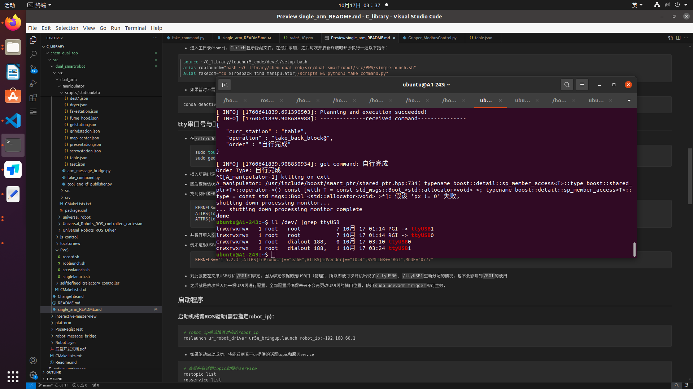

# 单臂例程使用教程

## 问题排查
- 若无法rviz中无法观察到机械臂实际姿态，可以在示教器上终止pro_1.urp程序，重开roblaunch
## 常用指令
- 渲染本文档(markdown)：`Ctrl+Shift+V`
- 重新加载串口绑定文件：`sudo udevadm trigger`
- 查看已连接串口：`ll /dev/ |grep ttyUSB `
- 退出conda环境：`conda deactivate`
   - 
- 查找包路径：`rospack find (your package name)`
## ROS1安装


```shell
wget http://fishros.com/install -O fishros && . fishros
[1]:一键安装(推荐):ROS(支持ROS/ROS2,树莓派Jetson)
[3]:一键安装:rosdep(小鱼的rosdepc,又快又好用)
[7]:一键安装:VsCode开发工具
[5]:一键配置:系统源(更换系统源,支持全版本Ubuntu系统)
[13]:一键配置:python国内源
```

## rosdep安装依赖项

```shell
sudo rosdep init
rosdep update
cd ~/C_library/teachur5_code
rosdep install --from-paths src --ignore-src -r -y
```

- 其他常用包可以输入以下指令安装：
```shell
sudo apt-get install ros-noetic-moveit-core ros-noetic-moveit-kinematics ros-noetic-moveit-ros-planning-interface ros-noetic-moveit-visual-tools ros-noetic-moveit ros-noetic-moveit-simple-controller-manager ros-noetic-joy ros-noetic-serial ros-noetic-joint-trajectory-controller ros-noetic-pinocchio ros-noetic-cartesian-control-msgs ros-noetic-ompl ros-noetic-ur-msgs ros-noetic-speed-scaling-interface ros-noetic-ur-client-library ros-noetic-industrial-robot-status-interface ros-noetic-scaled-joint-trajectory-controller ros-noetic-socketcan-interface ros-noetic-soem ros-noetic-rosparam-shortcuts  ros-noetic-force-torque-sensor-controller  ros-noetic-pilz-industrial-motion-planner ros-noetic-ompl ros-noetic-chomp-motion-planner ros-noetic-tf-conversions ros-noetic-speed-scaling-state-controller ros-noetic-pass-through-controllers ros-noetic-rqt ros-noetic-rqt-common-plugins ros-noetic-rqt-controller-manager -y 
```
# 机器人示例程序指南

## 编译

- 进入工作空间，以下命令在工作空间进行：
```shell
cd ~/C_library/teachur5_code
# -j8限制编译使用的线程数量，防止电脑卡死机！
catkin build -j8
# 单独编译若干个包(manipulator,gripper_modbus)
catkin build manipulator gripper_modbus -j8
# 清理先前的编译结果
catkin clean
```

## ~/.bashrc
- 进入主目录(Home)，`Ctrl+H`显示隐藏文件，在最后添加，之后每次开启新终端时都会执行一遍以下指令：
```shell
source ~/C_library/teachur5_code/devel/setup.bash
alias roblaunch="bash ~/C_library/chem_dual_rob/src/dual_smartrobot/src/PWS/singlelaunch.sh"
alias fakecom="cd $(rospack find manipulator)/scripts && python3 fake_command.py"
```
- 如果暂时不需要conda，建议在最后额外加一行：
```shell
conda deactivate
```
## tty串口号与工控机的USB口绑定

- 若执行`ll /dev/ |grep ttyUSB`未出现/PGI->ttyUSB*,/RGI->ttyUSB*，则说明夹爪的通信串口还未绑定，每次开机或重新插拔串口号都有可能发生变化。
- 在`/etc/udev/rules.d`目录下直接创建`99-miiboo-usb-serial.rules`并打开：
    ```shell
    sudo touch /etc/udev/rules.d/99-miiboo-usb-serial.rules
    sudo gedit /etc/udev/rules.d/99-miiboo-usb-serial.rules
    ```

- 插入所需绑定的USB线，查询其`ttyUSB*`号：`ll /dev/ |grep ttyUSB`

- 随后查询该USB相关信息，其`/dev/ttyUSB*`就是上面查询到的串口号：`udevadm info -a -p $(udevadm info -q path -n /dev/ttyUSB*)`

- 找到例如`KERNELS=="1-5.2.3:1.0"`这种带冒号的`KERNELS`，我们需要关注它的下一个不带冒号的`KERNELS`，找到其中的三个参数：

    ```bash
    KERNELS=="1-5.2.3"
    ATTRS{idProduct}=="ea60"
    ATTRS{idVendor}=="10c4"
    ```

- 并将其填入`99-miiboo-usb-serial.rules`的相应位置

- 例如这根USB线属于左夹爪(RGI)，则所填内容为：

   ```yaml
   KERNELS=="1-5.2.3",ATTRS{idProduct}=="ea60",ATTRS{idVendor}=="10c4",SYMLINK+="RGI",MODE="0777"
   ```

- 到此就把左夹爪USB线和`/RGI`相绑定，因为绑定依据的是USB口（物理），所以即使每次开机出现了`/ttyUSB0`、`/ttyUSB1`重新分配的情况，也不会影响到`/RGI`的使用

- 之后就是依次插入每一根USB线进行配置，全部配置后确保未来不会再更改USB线的插口位置，使用`sudo udevadm trigger`即可生效，

## IP与External Control配置

### 电脑IP配置
   - 查看本机IPv4地址和子网掩码
   - 若是使用自己的电脑，插入网线后需要设置IPv4在192.168.60.0～192.168.60.255之间，尽量为该网线所对应电脑原本的IP
### 机械臂配置
   1. 查看示教器`设置机器人-URCap`，确保`External Control`已经被安装
   2. 查看示教器`设置机器人-网络`，在`静态地址`中设置并`应用`，设置可能失败，可以退出再进入，检查IP是否设置成功:
      - 机器人IP:192.168.60.*，尽量不要修改，避免与其他机器冲突
      - 子网掩码:255.255.255.0
      - 默认网关:0.0.0.0
   3. 查看示教器`为机器人编程-安装设置-External Control`，控制端`Host IP`为电脑IP，暴露的受控端口`Custom port`为`50002`，控制端名称随意
   4. 编写程序`pro_1.urp`，内容只需要一条`External Control`指令
- 电脑尝试`ping 机械臂IP`，若能ping通则说明已经与机械臂连接

## 启动程序

### 启动机械臂ROS驱动(需要指定**robot_ip**)：

```shell
# robot_ip后请填写对应的robot_ip
roslaunch ur_robot_driver ur5e_bringup.launch robot_ip:=192.168.60.1
```

- 如果驱动启动成功，将能看到若干ur提供的话题topic和服务service
```shell
# 查看所有话题topic和服务service
rostopic list
rosservice list
# 查看实时的关节角数据
rostopic echo /joint_states
```

### 启动**moveit！**

```shell
roslaunch single_robot_moveit_config ur5e_moveit_planning_execution.launch
```

### 启动**Rviz GUI**:

```shell
roslaunch manipulator single_arm_rviz.launch
```

### 启动**夹爪服务器(PGI/RGI)**:

```shell
roslaunch gripper_modbus Gripper_ModbusControl.launch type:=RGI port:=/dev/RGI prefix:=RGI
roslaunch gripper_modbus Gripper_ModbusControl.launch type:=PGI port:=/dev/PGI prefix:=PGI
# (可选)启动夹爪测试UI
rosrun gripper_modbus gripper_gui.py
```
### 启动**机械臂应用层**:

```shell
roslaunch manipulator A_robot_start.launch Dual_arm_flag:=false Dashboard_flag:=true Locator_flag:=false Load_JPfile:=robot
```

### 启动**手柄驱动**:

```shell
roslaunch js_control js_control.launch
```
- 适配罗技F710手柄，使用前需要将顶部的D/X开关切换至D，按任意键退出休眠模式，若手柄与电脑未连接，则MODE灯闪烁。若正常连接，需要按MODE按钮直至MODE灯常亮。
- **手柄权限**：按下Ls手柄获得机械臂控制权限，按下Rs释放权限，**与之后的fakecom存在权限冲突，务必在运行fakecom前释放手柄权限**
- **机械臂控制**：X、Y、A、B、LB、RB控制机械臂移动，Ls摇杆、LT、RT控制机械臂转动，共6个自由度
- **夹爪控制**：
   - Rs摇杆往左拨一次后，左右键控制PGI开合，上键触发PGI初始化(行程校准)，下键触发RGI初始化(形成校准)
   - Rs摇杆往右拨一次后，左右控制RGI开合，上下控制RGI转动
- **速度模式**：按BACK一次后进入粗调模式，按START一次后进入细调模式，二者速度不同，作用于机械臂和夹爪

### 启动**点位记录脚本**:

```shell
roslaunch manipulator B_JP_record.launch Record_JPfile:=robot
```
- 使用手柄或示教器将机械臂移动到期望位置，随后按照指引输入点位名称。
- 点位数据将保存在manipulator/data/robot_JP.json中，包含该动作的关节角和位姿
```json
{
   "joints" : [
      {
         "name" : "test1_inverse",
         "value" : [
            -1.5297468344317835,
            -1.2676690260516565,
            -1.7067893187152308,
            -1.7337849775897425,
            1.6542844772338867,
            -0.76953202882875615
         ]
      }
   ],
   "poses" : [
      {
         "name" : "test1",
         "value" : [
            0.11209027620099403,
            0.36472334040102367,
            0.53574464704381197,
            -0.91885919024048279,
            -0.39274075535168063,
            0.034831927595180556,
            0.015466881275804886
         ]
      }
   ],
   "station_poses" : []
}
```

### 编写**动作组**:
- 动作组保存在manipulator/scripts/stationdata/table.json中，每行为一条动作指令，详见manipulator/scripts/fake_command.py
```json
{
    "cmd": [
        {
            "name": "grab_block_to_pgi@",
            "scripts": [
                "F J robot",
                "G 0 1000 0 0%idle idle",
                "A S PTP J 0.2 0.2 reset",
                "A S PTP J 0.2 0.2 block@_high",
                "A S LIN J 0.05 0.05 block@_low",
                "G -1 0 0 99999999%idle clamping",
                "A S LIN J 0.05 0.05 block@_high",
                "G -1 -1 360 99999999%idle clamping",
                "A S PTP J 0.2 0.2 block_pgi_high",
                "A S PTP J 0.2 0.2 block_pgi_mid",
                "A S LIN J 0.05 0.05 block_pgi_low",
                "G 1000 -1 0 99999999%clamping clamping",
                "G -1 1000 0 99999999%clamping idle",
                "A S LIN J 0.1 0.1 block_pgi_high",
                "A S PTP J 0.2 0.2 reset"
            ]
        }
    ]
}
```

### 执行**动作组**
- **必须提前释放手柄权限(Rs)**，随后运行`fakecom`或在manipulator/scripts/目录下运行`python3 fake_command.py`
- 详见manipulator/scripts/fake_command.py

## 打开终端并输入`roblaunch`可以一键开启所有驱动